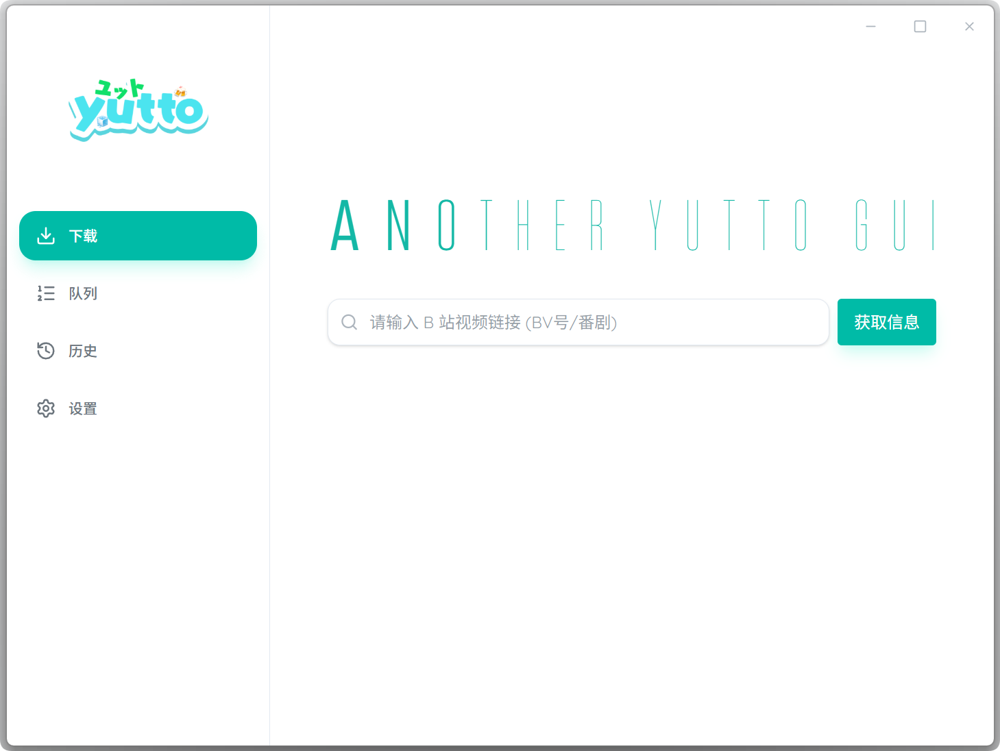

# Another Yutto GUI

基于 Tauri 2 + Vue 3 的 Bilibili 视频下载器图形界面，为 [Yutto](https://github.com/yutto-dev/yutto) 提供GUI。



## Wayland 支持

如果你在 Wayland 环境下，需要配置：

```bash
export GDK_BACKEND=wayland
export WEBKIT_DISABLE_COMPOSITING_MODE=1
```

## 打包独立应用

1. **构建 yutto 可执行文件**
   ```bash
   cd build-scripts
   # Windows
   ./build-yutto.ps1
   # macOS/Linux
   ./build-yutto.sh
   ```

2. **下载 ffmpeg 二进制文件**
   - Windows: https://github.com/BtbN/FFmpeg-Builds/releases
   - macOS: https://evermeet.cx/ffmpeg/
   - Linux: https://johnvansickle.com/ffmpeg/

3. **重命名并放置到 `binaries/` 目录**
   ```
   binaries/
   ├── yutto-x86_64-pc-windows-msvc.exe
   ├── ffmpeg-x86_64-pc-windows-msvc.exe
   ├── yutto-x86_64-apple-darwin
   ├── ffmpeg-x86_64-apple-darwin
   ├── yutto-aarch64-apple-darwin
   ├── ffmpeg-aarch64-apple-darwin
   ├── yutto-x86_64-unknown-linux-gnu
   └── ffmpeg-x86_64-unknown-linux-gnu
   ```

4. **构建应用**
   ```bash
   npm run tauri build
   ```

## TODO
-  [x] 识别不同视频链接
-  [x] 下载队列暂停、取消
-  [x] 视频预览字幕、弹幕显示
-  [x] 内置 yutto 和 ffmpeg
-  [x] 下载进度优化
-  [x] 评论下载优化
-  [ ] Web端 (吗？)

## 致谢

- [Yutto](https://github.com/yutto-dev/yutto) - 一个可爱且任性的 B 站视频下载器
- [Tauri](https://tauri.app/) - Tauri 2.0 创建小型、快速、安全、跨平台的应用程序
- [Vue.js](https://vuejs.org/) - 渐进式 JavaScript 框架

## 免责声明
本软件提供的所有内容，仅可用作学习交流使用，禁止用于其他用途。请在下载24小时内删除。为尊重作者版权，请前往资源的原始发布网站观看，支持原创，谢谢。
